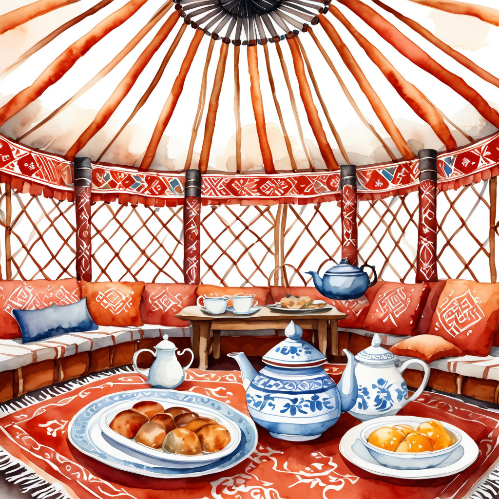

# Beshbarmak Cooking Game

A cozy, interactive cooking game where you learn to make the traditional Kazakh-Kyrgyz dish — **Beshbarmak** — step by step inside a watercolor-style kitchen.

## ✨ Features

- **Step-by-step gameplay** — From boiling broth to cutting noodles.
- **Watercolor visuals** — Soft, hand-drawn assets for a cozy vibe.
- **Drag-and-drop interface** — Learn ingredients through interaction.
- **Progress tracking** — Celebrate each cooking milestone!

## 🛠️ Technologies

- HTML5
- CSS3
- Vanilla JavaScript
